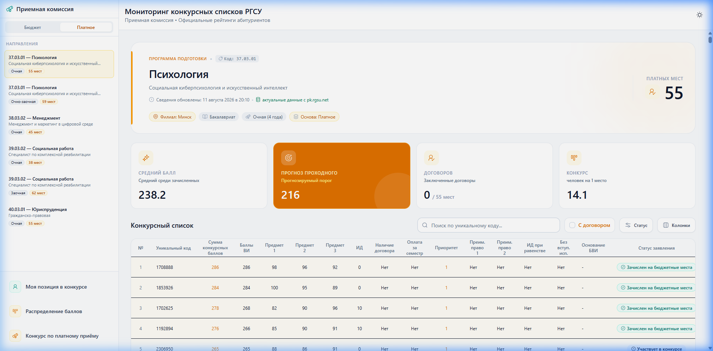
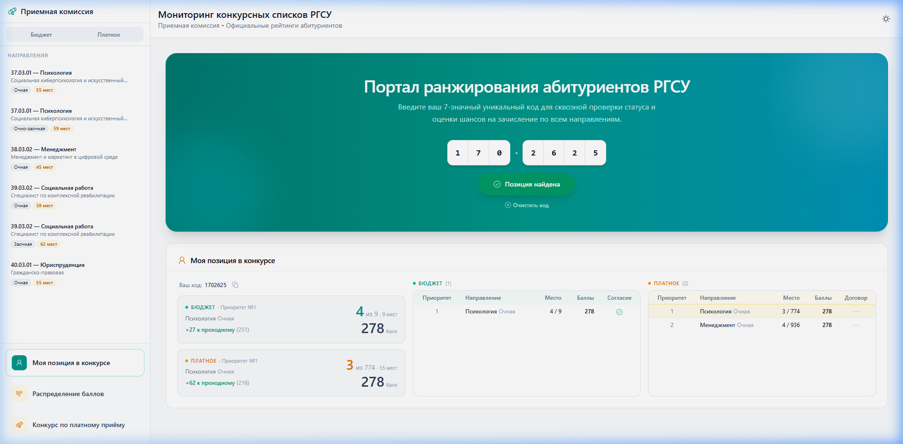
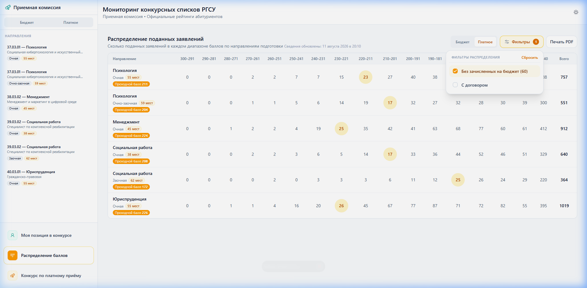
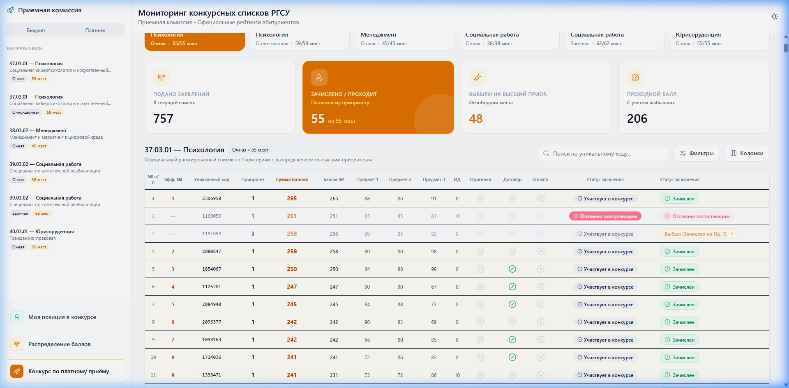
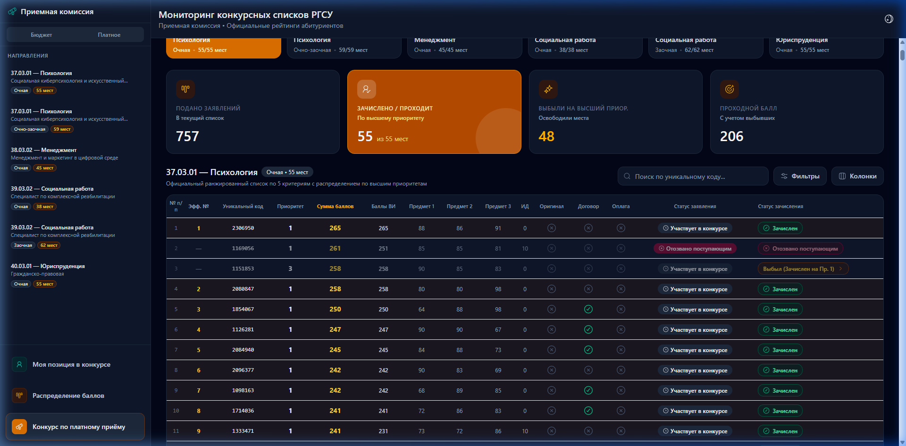

# Руководство пользователя: Мониторинг конкурсных списков РГСУ (Платный приём и аналитические сервисы)

Данное руководство содержит подробное описание ключевых функциональных разделов веб-системы **«Мониторинг конкурсных списков РГСУ»** (платный приём, оценка персональной позиции, распределение баллов и реестр договоров), проиллюстрированное наглядными скриншотами и записью полного видеопрохождения.

---

## 📹 Запись видеопрохождения

Полная сессия взаимодействия пользователем с ключевыми разделами платного приёма и аналитики зафиксирована в формате WebP-видео:

---

## 1. Вкладка «Платное» — Конкурсные списки по платной форме обучения

Раздел предоставляет информацию по конкурсным группам на платной основе обучения с отображением актуальных лимитов мест, прогноза проходного балла и ранжированного списка абитуриентов.

### Основные возможности:
- **Переключение формы обучения:** Переключатель в верхней части боковой панели позволяет мгновенно отфильтровать направления платной основы.
- **Информационные карточки направления:**
  - **Средний балл:** Расчет средних конкурсных баллов абитуриентов.
  - **Прогноз проходного балла:** Динамическая оценка граничного балла для поступления на текущую специальность.
  - **Договоров / Платных мест:** Текущее количество заключенных договоров относительно выделенного объема платных мест.
  - **Конкурс:** Нагрузка (человек на 1 платной место).
- **Поиск и интерактивные фильтры:** Поиск по уникальному коду/СНИЛС, фильтрация по наличию договора, статусу заявления и колонкам.

---

## 2. Раздел «Моя позиция в конкурсе»

Персональный инструмент абитуриента для сквозной оценки шансов на зачисление по всем выбранным направлениям подготовки (как на бюджетной, так и на платной основе).

### Основные возможности:
- **Ввод СНИЛС / Уникального кода:** Введите свой 7-значный код или номер СНИЛС для получения моментального отчета.
- **Главная рекомендация:** Оценка приоритетного направления с отображением текущей позиции относительно общего числа платных/бюджетных мест и запаса баллов до прогнозируемого проходного.
- **Сводная таблица по приоритетам:** Наглядное сравнение позиций абитуриента по 1-му, 2-му и последующим приоритетам подачи документов.

---

## 3. Раздел «Распределение баллов» — Аналитическая матрица

Тепловая матрица плотности конкурсных баллов абитуриентов по всем направлениям подготовки университетского филиала.

### Основные возможности:
- **Диапазоны баллов:** Разбивка абитуриентов по интервалам баллов (300–291, 290–281, ..., <140).
- **Подсветка проходных порогов:** Маркировка интервала, в который попадает прогнозируемый проходной балл по каждому направлению.
- **Фильтрация аналитики:**
  - Переключение основы («Бюджет» / «Платное»).
  - Фильтр **«Без зачисленных на бюджет»** — позволяет исключить поступивших на бюджет абитуриентов и объективно оценить реальную конкурсную ситуацию среди абитуриентов платного приёма.
  - Экспорт сводки в PDF формат.

---

## 4. Раздел «Конкурс по платному приёму» — Реестр договоров и оплата

Специализированный рабочий стол для администраторов приемной комиссии и абитуриентов, позволяющий отслеживать статус заключения договоров и финансовой оплаты.

### Основные возможности:
- **Оперативная аналитика верхнего уровня:**
  - Общее количество проанализированных заявлений.
  - Доля абитуриентов, проходящих по высшему приоритету.
  - Количество освободившихся мест вследствие выбытия абитуриентов на более высокие приоритеты.
  - Окончательный прогнозируемый проходной балл.
- **Ранжированный список с финансовыми статусами:**
  - Статусы участия: `Зачислен`, `Участвует в конкурсе`, `Выбыл (Зачислен на Пр. 1)`, `Отозвано поступающим`.
  - Отметки наличия оригинала документа, факта заключенного договора и поступившей оплаты за семестр.

---

## 5. Персонализация и тёмный режим (Dark Mode)

Система поддерживает высокое визуальное качество оформления с поддержкой тёмной темы для комфортной работы при разном уровне освещения.

---

> [!NOTE]
> Все актуальные данные синхронизируются в реальном времени с сервером Приемной комиссии РГСУ (`pk.rgsu.net`).
